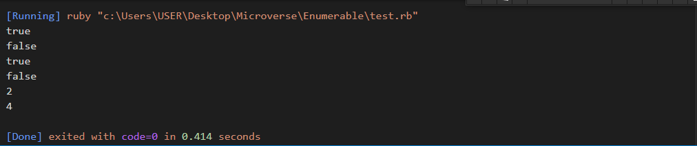

# Enumerable

In this project you will learn how to use a module inside your class. For this you will create a class MyList and a module MyEnumerable. Your module MyEnumerable will implement a subset of the functionality of [Enumerable](https://ruby-doc.org/core-3.0.0/Enumerable.html).

The Enumerable mixin provides collection classes with several traversal and searching methods, and with the ability to sort. The class must provide a method each, which yields successive members of the collection. If #max, min, or sort is used, the objects in the collection must also implement a meaningful <=> operator, as these methods rely on an ordering between members of the collection.



## Built With
- Ruby

## Getting Started
**step1** cloning the project:
```
git clone https://github.com/ZahraArshia/Enumerable.git
```
**step2** You can use IRB for running the project or any compiler:
```
irb
```

## Author 1

👤 **Okoroji Victor aka Vickymarz**

- GitHub: [@githubhandle](https://github.com/vickymarz)

- LinkedIn: [LinkedIn](https://www.linkedin.com/in/okoroji-victor-ebube-8791741a0)

## Author 2

👤 **Zahra Arshia**

- GitHub: [@githubhandle](https://github.com/ZahraArshia)

- LinkedIn: [LinkedIn](https://www.linkedin.com/in/zahra-arshia/)

## 🤝 Contributing

Contributions, issues, and feature requests are welcome!

Feel free to check the [issues page](../../issues/).

## Show your support

Give a ⭐️ if you like this project!


## Acknowledgments

- Microverse 
- Coding partner

## 📝 License

This project is [MIT](./MIT.md) licensed.
